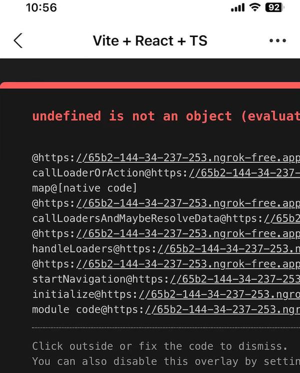

公司新上线的 `h5` 项目, 使用 `iphone` 测试发现, `微信`, `safari` 中能正常打开,
但是 `支付宝` 中一直是白屏状态.

<!--more-->

### 显示错误信息

在项目中加上这段代码, 可以显示开发中的 `runtime` 错误, 参考
[#2076](https://github.com/vitejs/vite/issues/2076)

```ts
if (import.meta.env.DEV) {
  // REGISTER ERROR OVERLAY
  const showErrorOverlay = (err) => {
    // must be within function call because that's when the element is defined for sure.
    const ErrorOverlay = customElements.get("vite-error-overlay");
    // don't open outside vite environment
    if (!ErrorOverlay) return;
    console.log(err);
    const overlay = new ErrorOverlay(err);
    document.body.appendChild(overlay);
  };

  window.addEventListener("error", showErrorOverlay);
  window.addEventListener(
    "unhandledrejection",
    ({ reason }) => showErrorOverlay(reason),
  );
}
```

现在用 `支付宝` 打开页面 就可以看到错误信息了

`undefined is not an object (evaluating 'request.signal.removeEventListener')`



进一步确认该错误来自 `react-router`
[loader](https://reactrouter.com/en/main/route/loader),
[lazy](https://reactrouter.com/en/main/route/lazy)

### 错误分析

支付宝内置浏览器, 对 `Request` 做了自定义修改, 该自定义 `Request` 没有 `signal`
属性字段, 导致用到 `request.signal` 的 `loader`, `lazy` 方法报错

### 错误修复

使用 [abortcontroller-polyfill](https://github.com/mo/abortcontroller-polyfill)
对 `Request` 进行修复

```ts
import "abortcontroller-polyfill/dist/polyfill-patch-fetch";
```

ps: 至于支付宝为何要自定义 `Request`, 这个问题我也想知道
