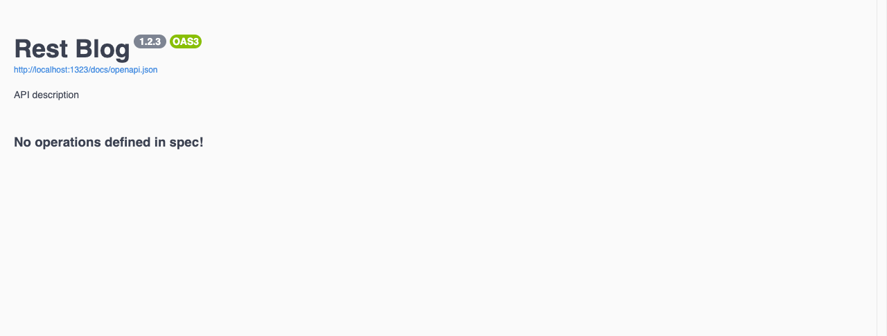
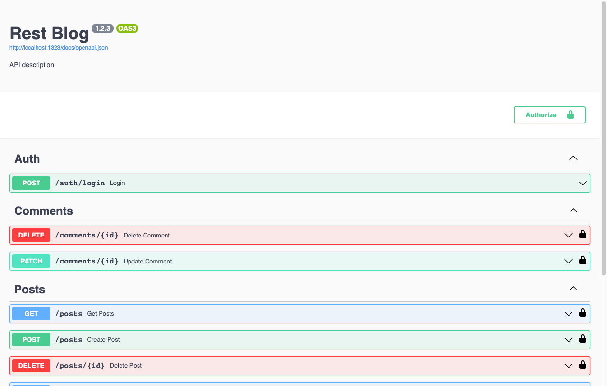
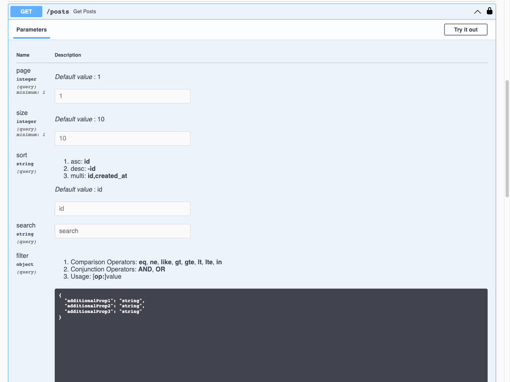

基于 [fourcels/rest](https://github.com/fourcels/rest),
[fourcels/paginate](https://github.com/fourcels/paginate),
[go-gorm/gorm](https://github.com/go-gorm/gorm) 快速搭建 `RESTful API`

<!--more-->

### 新建 rest service

```go
// main.go
package main

import (
	"log"

	"github.com/fourcels/rest"
	"github.com/swaggest/swgui"
)

func main() {
	s := rest.NewService()
	s.OpenAPI.Info.WithTitle("Rest Blog")

	// Swagger UI endpoint at /docs.
	s.Docs("/docs")

	// Start server.
	log.Println("http://localhost:1323/docs")
	s.Start(":1323")
}
```



### 新建 models

```go
// models/user.go
type User struct {
	ID        uint      `json:"id,omitempty"`
	Username  string    `gorm:"uniqueIndex" json:"username,omitempty"`
	Password  string    `json:"-"`
	Admin     bool      `json:"admin"`
	CreatedAt time.Time `json:"created_at,omitempty"`
}

// models/post.go
type Post struct {
	ID          uint           `json:"id,omitempty"`
	Title       string         `json:"title,omitempty"`
	Content     string         `json:"content,omitempty"`
	Tags        pq.StringArray `gorm:"type:text[]" json:"tags"`
	CreatedByID uint           `json:"created_by_id,omitempty"`
	CreatedBy   User           `json:"-"`
	CreatedAt   time.Time      `json:"created_at,omitempty"`
	UpdatedAt   time.Time      `json:"updated_at,omitempty"`
	DeletedAt   gorm.DeletedAt `gorm:"index" json:"deleted_at,omitempty"`
}

// models/comment.go
type Comment struct {
	ID          uint           `json:"id,omitempty"`
	Content     string         `json:"content,omitempty"`
	PostID      uint           `json:"post_id,omitempty"`
	Post        Post           `json:"-"`
	CreatedByID uint           `json:"created_by_id,omitempty"`
	CreatedBy   User           `json:"-"`
	CreatedAt   time.Time      `json:"created_at,omitempty"`
	UpdatedAt   time.Time      `json:"updated_at,omitempty"`
	DeletedAt   gorm.DeletedAt `gorm:"index" json:"deleted_at,omitempty"`
}
```

### 初始化 DB

```go
// models/db.go

var DB *gorm.DB

func init() {
	db, err := gorm.Open(postgres.Open((os.Getenv("DB_URL"))), &gorm.Config{})
	if err != nil {
		panic("failed to connect database")
	}

	// Migrate the schema
	db.AutoMigrate(&User{}, &Post{}, &Comment{})

	DB = db
}
```

### 初始化 router

```go
// main.go
func main() {
	// ...
	auth := s.Group("/auth", rest.WithTags("Auth"))
	auth.POST("/login", controllers.Login())

	user := s.Group("/users", rest.WithTags("Users"))
	user.POST("", controllers.CreateUser())

	post := s.Group("/posts", rest.WithTags("Posts"), rest.WithSecurity("bearerAuth"))
	post.Use(controllers.JwtMiddleware)
	post.POST("", controllers.CreatePost())
	post.GET("", controllers.GetPosts())
	post.GET("/{id}", controllers.GetPost())
	post.PATCH("/{id}", controllers.UpdatePost())
	post.DELETE("/{id}", controllers.DeletePost())
	post.POST("/{id}/comments", controllers.CreateComment())
	post.GET("/{id}/comments", controllers.GetComments())

	comment := s.Group("/comments", rest.WithTags("Comments"), rest.WithSecurity("bearerAuth"))
	comment.Use(controllers.JwtMiddleware)
	comment.PATCH("/{id}", controllers.UpdateComment())
	comment.DELETE("/{id}", controllers.DeleteComment())
	// ...
}
```



### 列表查询

```go
// models/post.go
type Post struct {
	// ...
	Title       string         `json:"title,omitempty" search:"title" filter:"title"`
	Content     string         `json:"content,omitempty" search:"content"`
	CreatedAt   time.Time      `json:"created_at,omitempty" filter:"created_at"`
	// ...
}


// controllers/post.go
func GetPosts() rest.Interactor {
	return rest.NewHandler(func(c echo.Context, in paginate.Pagination, out *[]models.Post) error {
		err := setupPaginate(c, in, out)
		if err != nil {
			return err
		}
		return nil
	})
}

func setupPaginate[T any](c echo.Context, p paginate.Pagination, out *[]T, query ...func(db *gorm.DB) *gorm.DB) error {
	var count int64
	if err := paginate.Paginate(models.DB, p, &count, out, query...); err != nil {
		return err
	}
	c.Response().Header().Set("X-Total", strconv.FormatInt(count, 10))
	return nil
}
```



### 示例源码

[fourcels/rest-blog](https://github.com/fourcels/rest-blog)
